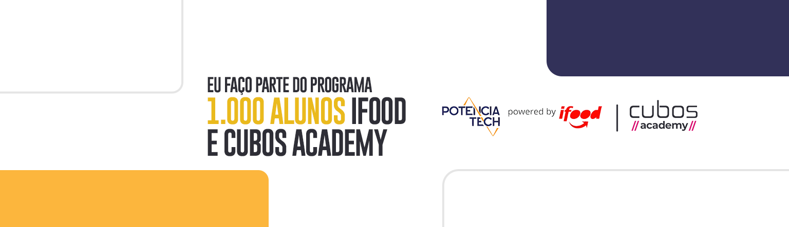
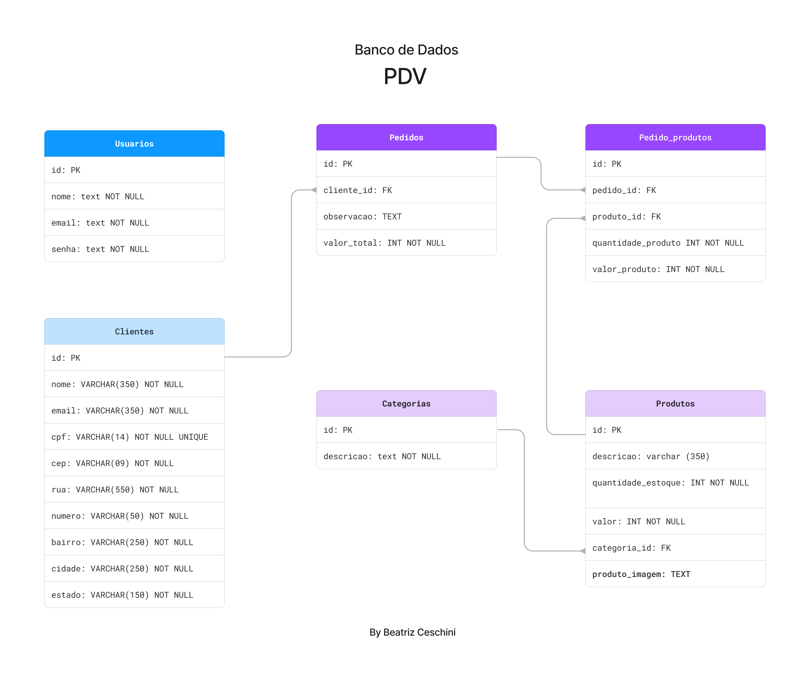

# Sobre o Projeto

Esse é o projeto de conclusão do curso **Desenvolvimento de Software - Foco em Backend** sendo uma parceria da escola [**Cubos Academy**](https://cubos.academy/) com o [**Ifood**](https://institucional.ifood.com.br/) através do programa [**Potência tech**](https://potenciatech.com.br/).



# API de PDV (Ponto de Venda) - Projeto de Conclusão do Curso Desenvolvimento de Software - Foco em Backend

O projeto apresenta uma API dedicada a um Ponto de Venda (PDV), especificamente concebida para aprimorar a gestão de produtos e clientes, promovendo uma otimização eficiente das operações diárias em empresas do setor de comércio. Ao possibilitar a criação de usuários, o sistema viabiliza o acesso a diversas rotas após a autenticação, oferecendo funcionalidades completas para a manipulação de produtos e clientes, incluindo operações de criação, consulta, edição e exclusão (CRUD).

### Banco de dados

Para o gerenciamento dos dados foi utilizado o PostgreSQL e criado um banco de Dados chamado `pdv`.
Observe a seguir a modelagem lógica do banco de dados:


**É possivel encontrar o arquivo de criação do banco de dados com o nome `dump.sql`.**

### Segurança

A API conta com criptografia de senha do usuário ultilizando a biblioteca [bcrypt](https://www.npmjs.com/package/bcrypt). Sendo a senha salva no banco de dados encriptografada de forma a impossibilitar que terceiros a obtenham.
A proteção das rotas e dados foi feita ultilizado um [Token de autenticação](https://www.npmjs.com/package/jsonwebtoken). Portanto, em cada funcionalidade é validado o token de autenticação do usuário logado, que deverá ser passado no header com o formato Bearer Token.

#### Criptografia de Senha:

A senha do usuário é criptografada antes de ser armazenada no banco de dados. Para isso, empregamos a biblioteca [bcrypt](https://www.npmjs.com/package/bcrypt). Dessa forma, mesmo que alguém tenha acesso ao banco de dados, as senhas estarão protegidas e não poderão ser facilmente decifradas.

```javascript
//Exemplo de corpo da requisição para cadastro de usuário (body)
{
    "nome": "José",
    "email": "jose@email.com",
    "senha": "jose"
}
```

#### Token de Autenticação:

Cada requisição feita à API deve ser autenticada por meio de um token de autenticação. Esse token é gerado no momento do login e deve ser incluído no header de todas as requisições subsequentes. Utilizamos a biblioteca [jsonwebtoken](https://www.npmjs.com/package/jsonwebtoken) para essa funcionalidade.

###### Exemplo de como incluir o token no header usando o Insomnia:

- Após realizar o login, copie o token gerado.
- Abra o Insomnia e vá para a requisição desejada.
- No header da requisição, adicione um novo campo com o nome Authorization e o valor Bearer SEU_TOKEN_AQUI.
- Isso garante que apenas usuários autenticados e autorizados possam acessar as rotas protegidas da API. **Mantenha o seu token seguro e não o compartilhe indiscriminadamente.**
- Essas medidas proporcionam uma camada adicional de segurança, garantindo a confidencialidade das informações e restringindo o acesso não autorizado.

#### Guia de Status Codes ultilizados:

```javascript
// 200 (OK) = requisição bem sucedida
// 201 (Created) = requisição bem sucedida e algo foi criado
// 204 (No Content) = requisição bem sucedida, sem conteúdo no corpo da resposta
// 400 (Bad Request) = o servidor não entendeu a requisição pois está com uma sintaxe/formato inválido
// 401 (Unauthorized) = o usuário não está autenticado (logado)
// 403 (Forbidden) = o usuário não tem permissão de acessar o recurso solicitado
// 404 (Not Found) = o servidor não pode encontrar o recurso solicitado
// 500 (Internal Server Error) = erro inesperado do servidor
```

## Tecnologias

`Javascript` `Node.js` `PostgreSQL`

# Para ultilizar na sua máquina

### Instações necessárias:

- [Node.js](https://nodejs.org/en) em versão 18 ou superior;
- [PostgreSQL](https://www.postgresql.org/download/);
- [Beekeeper Studio](https://www.beekeeperstudio.io/);
- [Insomnia](https://insomnia.rest/download);

## Passo a passo :

- Faça download do repositório no seu computador;
- Copie o arquivo `dump.sql` e realize a criação do banco de dados com ultilização do `Beekeeper` e `PostgreSQL`;
- Carregue o arquivo `Insomnia-PDV.json` no programa Insomnia e faça as adequações necessárias;
- Usando o terminal no diretório do projeto instale as dependencias através do `npm install`;
- Crie um arquivo `.env` de acordo com as informações presentes no arquivo `.env.exemplo` e preencha com as informações necessárias (Dados de conexão com o banco de dados, serviço de envio de email e Bucket da Backblaze);
- Utilize o comando `npm run start` para rodar a API em um servidor local;

# Acessando o PDV publicado:

### Instações necessárias:

- [Insomnia](https://insomnia.rest/download);

### Passo a passo:

- Carregue o arquivo `Insomnia-PDV.json` no programa Insomnia e faça as adequações necessárias;
- Acesse a aplicação: [API-PDV](https://important-ox-sun-hat.cyclic.app/) , copiando o link e adicionando a rota ao Insomnia;

# Squad


[Beatriz Ceschini ](https://github.com/TrizCes/)

[Bianca Albernaz ](https://github.com/BibiaTheRox)

[Flavia Rosa ](https://github.com/flaviaros4)


[Yara Garcia ](https://github.com/Yara-Garcia)

[Gislayne Sevirino ](https://github.com/gsevirino)

## Orientação


[Jessica Medeiros](https://github.com/jessicamedeirosp)

###### tags: `back-end` `módulo 5` `nodeJS` `PostgreSQL` `API REST` `desafio` `javascript` `squad` `scrum`
